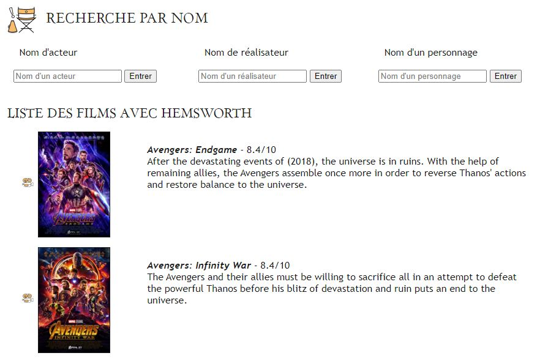

========================
Documentation technique
========================

Ce projet consiste à récolter les données concernant les films les plus populaires d’un classement créé par IMDb dans le but de les stocker et les afficher dans une application web avec le Framework Flask. J’ai alors utilisé Elasticsearch pour répondre au moteur de recherche et de suggestion sur le site. Enfin, Docker m'a permis de virtualiser un serveur de base de données et un Elasticsearch.

site : https://www.imdb.com/search/title/?groups=top_1000&ref_=adv_prv

Lancement du projet
-------------------

Cloner la base du projet : https://github.com/Cel10/DataEngineerTools.git

Mettez-vous dans le dossier contenant cette base de projet puis lancer cette commande dans un terminal/prompt :   

.. code-block:: bash

  > docker-compose up -d

Ensuite, mettez-vous dans le dossier contenant l’application Flask (/myApp) puis lancer la avec la commande :   

Windows

.. code-block:: bash

  > python run.py
   
Linux    

.. code-block:: bash

  > python3 run.py

Ainsi, l’application web sera accessible sur votre localhost du port 5000 : http://localhost:5000/.  

Voici un aperçu de la page d'accueil :

   
Voici un aperçu d'une page de recherche :

Scrapy 
---------
Scrapy est un Framework permettant de crawler des sites web et d'en extraire les données de façon structurée.

Librairie nécessaire : 

.. code-block:: bash

  > !pip install scrapy

``scrapy_run.ipynb`` : ce fichier rassemble les commandes de création du Scrapy jusqu'au lancement du spider.

Récupération des données - Spider
*********************************
Dans un premier temps, il faut récupérer les données, j’ai alors créé un projet Scrapy pour scraper les pages des films contenant toutes les informations dessus. 
J'ai alors également créé un spider qui contiendra les requêtes qui va me permettre de faire cela.
Le spider imdb.py récupère alors le titre, l’image d’affiche, la note, la liste des acteurs, etc. des films les plus populaires. Ainsi, afin d'extraire les données de la page, j’ai analysé les pages contenant les informations qui m’intéressaient et j’ai fait des requêtes xpath qui sont plus puissantes que les requêtes css. 

En effet, le spider parcourt toutes les pages des films et pas seulement la page du classement afin d’obtenir plus d’informations. Afin d’effectuer cela, un callback des liens de chaque page a été nécessaire. Les données sont alors stockées dans des scrapy.Item.

Les pipelines
*************
Les items générés au sein d'un projet Scrapy passent par les Pipelines, qui permettent de gérer et de traiter toutes les données scrapées au moment du scraping. 

J'ai défini deux pipelines : 

- ImdbcrawlerPipeline : permet d’uniformiser le texte
-	MongoPipeline : permet de stocker dans MongoDB

Plus précisément, la première permet de supprimer le contenu HTML, de valider les données scrapées et de supprimer tous les éléments qui ne nous intéressent pas. 
Puis, la deuxième permet de stocker les items dans des documents mongo.

Enfin, je récupère les données dans un fichier json afin de pouvoir les manipuler par la suite.

Elasticsearch
--------------
Elasticsearch est un moteur de recherche temp réel et Open Source.

Dans le but de gérer le moteur de recherche, j’ai utilisé Elasticsearch qui permet d’indexer les données et de faciliter les recherches sur celles-ci.

Flask
-----
Flask est un micro Framework permettant de développer des webapps. Il intègre un petit serveur web qui permet de servir des pages html. L'hôte par défaut est localhost 127.0.0.1 et le port 5000. 
La création de mon application se trouvera donc à cette adresse.
C'est également utile par sa capacité de générer des pages dynamiques.
Flask permet également d'interagir avec des requêtes GET et POST, ce qui sera intéressant dans ce cas.

Flask est géré par un moteur de templates qui va permettre de lire un fichier HTML relié à un fichier CSS.

Docker
-------
La technologie Docker m'a permis de manipuler mon Scrapy dans de bonnes conditions.
Il a également été utile pour virtualiser des serveurs MongoDB ainsi que Elasticsearch. Ce projet contient un fichier docker compose qui permet de montrer et lancer les images MongoDB et ES, essentielles au bon fonctionnement de cette web app.

Mise à jour de la base de données
---------------------------------
Afin de mettre à jour la base de données, il suffit d'ouvrir le fichier ``scrapy_run.ipynb`` et de lancer la dernière commande.
Puis de relancer le projet à la première étape.

Amélioration
------------
Pour une meilleure optimisation, il faudrait automatisé la mise à jour de la base de données en créant une classe qui lance le Scraping lors du lancement de l'application.
